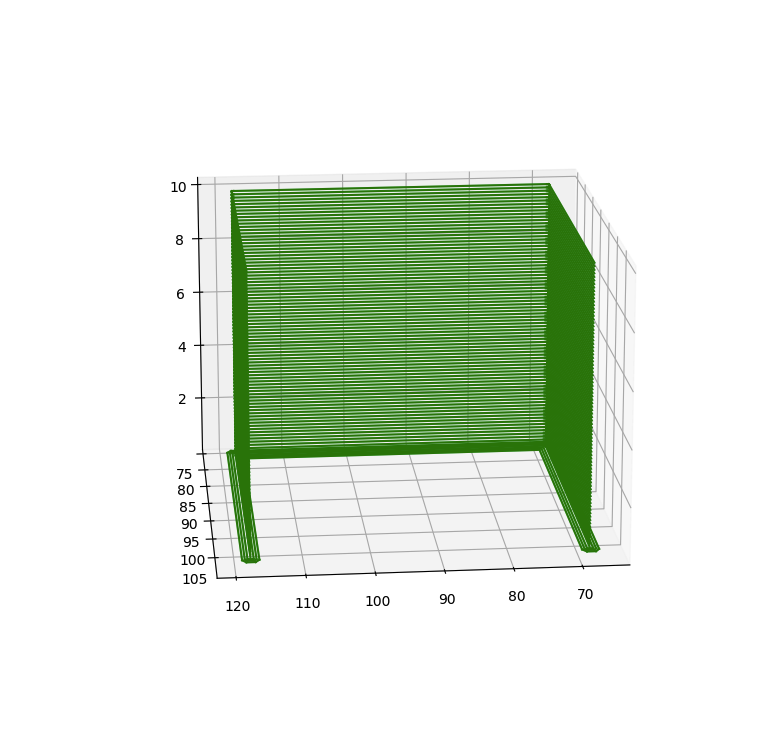

# Gcode Transfer

[][pypi_]
[][status]
[][python version]
[][license]

[][read the docs]
[][tests]
[][codecov]

[][pre-commit]
[][black]

[pypi_]: https://pypi.org/project/gcode-transfer/
[status]: https://pypi.org/project/gcode-transfer/
[python version]: https://pypi.org/project/gcode-transfer
[read the docs]: https://gcode-transfer.readthedocs.io/
[tests]: https://github.com/karajan1001/gcode-transfer/actions?workflow=Tests
[codecov]: https://app.codecov.io/gh/karajan1001/gcode-transfer
[pre-commit]: https://github.com/pre-commit/pre-commit
[black]: https://github.com/psf/black

## Features

A simple project that can transfer a g-code file into a model file.

## Requirements

click, matplotlib, numpy, open3D

## Installation

You can install _Gcode Transfer_ via [pip] from [PyPI]:

```console
# first clone the code and then
$ pip install .
```

## Usage

You can use the following commands to parse a g-code file and 
show the model in 3D model like

And also output the result to a model file.

```
$ python -m gcode_transfer {source_g-codefile} {result file}
```


The format of the model file is something like:
```
vertices:
[118.50377655  75.82322693   0.46599999]
[117.6930542   77.0539093   10.30599976]
...
[117.6930542   77.0539093   10.18599987]
triangles:
[81289 81324 81330]
[81229 81283 81285]
[81229 81285 81289]
...
[81229 81283 81325]
[81229 81325 81329]
```
Here the `[118.50377655  75.82322693   0.46599999]` represent the coordinate of each vertices and the `[81229 81285 81289]` represent the indexes of the vertex of which triangles are based on.


Also after using `--draw` argument you can get a raw picture of the printing line model.




## Contributing

Contributions are very welcome.
To learn more, see the [Contributor Guide].

## License

Distributed under the terms of the [MIT license][license],
_Gcode Transfer_ is free and open source software.

## Issues

If you encounter any problems,
please [file an issue] along with a detailed description.

## Further improvements
1. In the g-code file parse we only considered "G1" operations. Some of the other operations also might influence the result.
2. It might be possible to use some other algorithms to optimize the surface reconstruct progress.
3. The output model contains 70k points and more than 200k triangles. For a small model like miniwall it is inefficient. It would be better to create a algorithm to remove
all of the points created by our sampling methods and merge the triangles related to them.
4. For large models the memory usage might become a bottleneck. In this case, it is better to use
some other language to finish the job.

## Credits

This project was generated from [@cjolowicz]'s [Hypermodern Python Cookiecutter] template.

[@cjolowicz]: https://github.com/cjolowicz
[pypi]: https://pypi.org/
[hypermodern python cookiecutter]: https://github.com/cjolowicz/cookiecutter-hypermodern-python
[file an issue]: https://github.com/karajan1001/gcode-transfer/issues
[pip]: https://pip.pypa.io/

<!-- github-only -->

[license]: https://github.com/karajan1001/gcode-transfer/blob/main/LICENSE
[contributor guide]: https://github.com/karajan1001/gcode-transfer/blob/main/CONTRIBUTING.md
[command-line reference]: https://gcode-transfer.readthedocs.io/en/latest/usage.html
